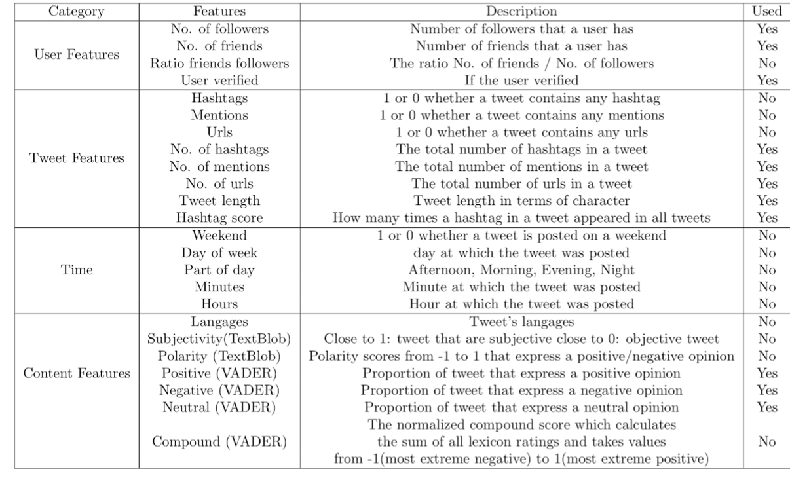
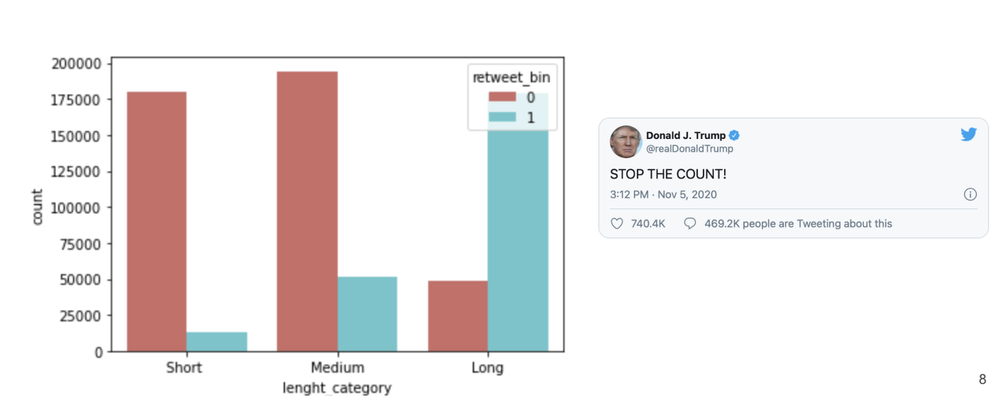

# Twitter_Covid19

The main goal is to build a Retweet Prediction Model that predicts how many retweets a tweet will get and shows how different features affect its performance.
In the first part, I did an analysis of the feature in order to understand deeper the dataset. 
In a second part, I adopted different Machine Learning approaches using data related to the author of the tweet, and to the characteristics of the message itself which includes Sentiment Analysis.

## Feature Engineering

The training dataset we have been provided with contains 665 777 samples of tweets related to COVID-19. 

On top of the features provided by the challenge for each tweet which has been introduced, I extracted more features which are described in detail in Table 1, based on past research in the field, as well as on our intuition, we calculated some extra features which seemed to influence the number of retweets a tweet might get. The features we used for training models and can be classified into four categories: (1) user features, (2) content features, (3) time features, and (4) sentiment features.
We have explored many avenues that may or may not have been used for different reasons. We have listed in this table the different features we have worked with, and whether we have implemented them in our prediction models or not.

## User Feature Related 

User Features : denote a set of features related to the author of a tweet: whether he is verified, how many followers and friends he has, and the total number of statuses he has posted. In addition to the number of followers and friends of a user, I also included the ratio of those two numbers. The total number of tweets shows the activity level of a user and we found that it helped to improve the prediction performance. 
My first hunch was to say that a verified accompt is strongly correlated with getting more retweeting. By a simple visualization we can notice that the rate of people checking who tweet is enormously correlated to the rate of tweeting who have been retweeted.  It is easy to understand that a verified account is more influential, because it is often more followed, and often more influential on public opinion

Taking the example of Donald Trump, a very famous certified Twitter user. 
We notice that these tweets are always retweeted massively, no matter the subject or the connotation of the subject. Let's take the example of 2 of these tweets, one congratulating China and another one blaming it. In both cases the tweet was RT massively. Verified accounts are therefore more often retweeted regardless of the content of the tweet.
By grouping, we can observe that 72% of the tweet from unverified users are not retweeted compared to less than 1% of the tweet from verified users are not retweeted.

## Tweet Related Feature

{Tweet Features} :  include a set of general information about the tweet: the number of hashtags and mentions it contains. Tweets with hashtags and mentions reach more people, and generally get more engagement than tweets without.Initially, the analysis focused on the correlation between the number of hashtags and the fact that the tweet is retweeted. But a large majority of tweet does not contain any hashtag at 89%, so analysing the correlation was useless. We have therefore defined a more precise feature called hashtag scores:
We defined a attributed to every tweet, calculated as such: first, we created a hashtag dictionary whose keys are all the unique hashtags found in the training set, and whose values are the sum of retweets every hashtag has gotten. Next, for every tweet, we go over the hashtags it contains, and we add up the different scores retrieved from the dictionary. This allows us to get a sense of which hashtags generate more engagement. We've shown above a representation of the top 20 most used words in hashtags to give you a more global representation of the hashtag score. The most popular hashtag is the one that speaks of covid 19 in various spellings

I also chose to add a tweet length feature, calculated the length based on the number of words, not the number of letters because it was more judicious and the results were more accurate. We have separated the classes into 3 sets of 20k data to avoid having unbalanced classes and therefore a false result. Thus we notice that the longer a tweet is, the more likely it is to be retweeted, and a short tweet is less likely to be retweeted, as it may be less insightful. Exceptions can be that a certified account as we have seen above will necessarily have retweets. We can take as an example this famous tweet from Trump which is only 3 words long but has been retweeted en masse. It is therefore an important factor, but not the only one.

## Sentiment Analysis

Sentiment Analysis, or Opinion Mining, is a sub-field of Natural Language Processing (NLP) that tries to identify and extract opinions within a given text. The aim of sentiment analysis is to gauge the attitude, sentiments, evaluations, attitudes and emotions of a speaker/writer based on the computational treatment of subjectivity in a text.
We found it important to do a sentiment analysis of the tweets in order to better capture the mining of the text.
We used the Python VADER package to interpret and classify the emotions on a tweet. VADER (Valence Aware Dictionary and sEntiment Reasoner) is a lexicon and rule-based sentiment analysis tool that is specifically attuned to sentiments expressed in social media. VADER uses a combination of A sentiment lexicon is a list of lexical features (e.g., words) which are generally labelled according to their semantic orientation as either positive or negative. VADER analyses sentiments primarily based on certain key points: Punctuations, Capitalization(use of upper case). First we work with TextBlob , but we choose to switch to VADER because it’s performs very well with emojis, slangs, and acronyms in sentences, making our analysis more adapted to Twitter.
 The social features added were about the polarity analysis of  tweet which determines whether it expresses a positive, negative or a neutral opinion. 
 
 
 For example, We chose to show as an example during this presentation a significant tweet because it had more than 1000 RT. This tweet comes from an uncertified user.. 
The Positive, Negative and Neutral scores represent the proportion of text that falls in these categories. This means our sentence was rated as 0% Positive, 67,5% Neutral and 32,5% Negative. Hence all these should add up to 1. It is true that the negative and neutral feeling is well perceived here (no presence of upper case or punctuation but the tweet has been relatively well noted)
The Compound score is a metric that calculates the sum of all the lexicon ratings which have been normalized between -1(most extreme negative) and +1 (most extreme positive). In the case above, the compound score turns out to be -0.95 , denoting a very high negative sentiment. This metric is the most important one to look at when analysing sentiment with VADER.

